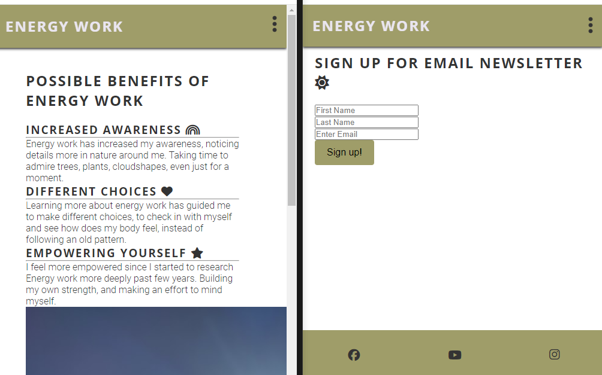

# Energy Work

This project's goal is to share different types of methods used for Energy Work, to show people how these methods can make a difference to our wellbeing. This page is suitable for people who are interested in using their own hands, colour, imagination, to work with their energy and maybe clear some energy blocks. Many of this page's author's friends and family have asked her for tips in regards to energy work, which tools to use. It's lovely to be able to gather some of her research on this page, and share the links instead of individual messages. And this way people can choose which method seems the best for them, instead of author sharing her "latest find". She has had interest and passion for natural healing, energy work from very young age. For the creator of this page, natural methods seemed always normal part of her life.

![Responsive Mockup] place an image here

## Features

Home page shares energy tools how to start to work or sense your own energy. On this page visitor can click on links to access Youtube videos, find a link that brings visitor to another page to read an example of an ebook (how to understand your body and some symptoms), or click on a link to learn about Tapping EFT. 
This page includes an image taken by me, Ballyheigue County Kerry. I feel good and peaceful looking at this image, and I hope visitors of this site have a pleasant feeling looking at the image, and that they can find links useful.

Benefits page: the goal here is to share the possible benefits from working with your own energy. It is understandable that each person has their own unique experiences, and examples given under Benefits section are some of the changes that the author of this page has noticed.

Sign up page is created for the project to show that form works. At the moment sign ups won't be saved anywhere, as it's just for the purpose of this project

### Existing Features

-_Favicon_

- An original image, Fenit county Kerry beach photo taken by author of this page, was converted with Favicon into a suitable Favicon for this website

https://favicon.io/favicon-converter/

-_Navigation Bar_

- Featured on all three pages. The full responsive navigation bar includes links to the Home page, Benefits and Sign Up page, and it is same in each page to allow for easy navigation. 
- Navigation bar allows user to navigate from page to page, across different kind of devices, without having to return to the previous page or Home page first

-_The landing page image_

- The landing page image is a photo of the Ballyheigue beach in county Kerry, captured by the creator of this page. This beach-side scenery brings hopefully a smile to the visitor's face, or feeling of light and tranquility

-_Disclaimer_

-Page creator has included a Disclaimer for this page. To clarify that this page is made as a project part of Software Development course. This page offers no medical assistance, and information or experience shared on this page is not a replacement for medical care or for prescribed medication. Author of this page values both methods: medical care, medication and natural methods to improve wellbeing. In author's opinion, medical treatment and natural methods are needed, and they can work together to enhance the outcome.

-Reading Energy Work page, or following the links or methods reviewed here, leaves all of the responsibility with the visitor of the page. 

-Author of this page has no medical background. Researching energy tools has been author's hobby for this lifetime.

![Disclaimer] place an image here

-_Tools for Wellbeing Table_

- Content of this table is aimed to make it easy for the user to find the area they are interested in, and to click on the video link, or link to read part of the book mentioned on the table. Autoplay and full-screen option have been removed from the embed code, to support visitors who prefer to play videos at their own time, at their own terms. Embed code helps to see what these videos are about. 

- Table also includes samples of page creator's personal experiences while using all of these different energy tools

![Tools for Wellbeing] place an image here

-_Social Media Links_

-Links for social media have been added in the footer for all of the pages. All links are clickable, and visitor is taken to the main page of each website. As this project is a sample project by a software development student, these links are not linked to any social media connected to Energy Work.

-All social media links open in a new page, which leaves Energy Work page open, and visitor has an option to return to this page if they so wish to do

![Social Media Links] place an image here

-_Benefits Section Image_

-This image is a photo taken in Fenit county Kerry, by the author of this page. Author is hoping to share the peacefullness feeling from the water, sunshine, mountains on the background

![Benefits Section Image] place an image here

-_Benefits Section_

- Here three different kind of benefits have been listed, with Font Awesome icons to symbolise each different benefit from energy work, rainbow favicon as a symbol for being more aware of nature, heart favicon to symbolise how making different choices can mean following your heart more, and star favicon to symbolise empowerement, feeling like a star.

![Benefits Section] place an image here

-_Sign Up image_

- add an image, then talk about it. 

![Benefits section image] place an image here

-_Sign Up_

- This form has been created for the project, to show functioning form. The author added Title option, with a drop down menu, and fields for First Name, Last Name and an email address. Form comes with Sign Up button, to complete signing up for emails. If it was a form for an actual business, or sole trader, blogger, email sign up would mean receiveng updates about the latest energy work research that the author has found, or read about. 

- Sign up for emails has a favicon of a sun beside it, to brighten up the visitor's day. 

- After signing up, visitor will see a confirmation

#### Features Left to Implement

- As project's due date is today, 22.12.2023, and the site is still not completely ok on mobile view, there is still a lot to do. Media settings, to adjust Image label on Benefits page, tidy up table on the landing page. Due to unforseen circumstances I was not able to work on the project for some of the days. I understand that I'll have an opportunity in 2024 to adjust this project, once Code Institute says it's ok to edit again. 

## Testing

- Sign Up form requests @ sign 
 

### Validator Testing

- HTML 
- as project isn't complete, no testing done yet

- CSS 
- as project isn't complete, no testing done yet

### Unfixed Bugs
- as project isn't complete, no testing for bugs done yet

## Deployment

- The site was deployed to GitHub pages. The live link can be accessed here:
https://github.com/BarbyKelly/Project-1.git

## Credits

- Initial code for this project came from Love Running - Essentials Project
https://github.com/Code-Institute-Solutions/love-running-v3.git

- Images

All of the photos used on the site are taken by the author of this website

- Favicon

https://favicon.io/favicon-converter/
I used this website to convert a photo taken by me, into a favicon. Original image Fenit Co. Kerry, Ireland 

- Book Cover

I saved image of Inna Segal's book from this amazon page:
https://www.amazon.com/Secret-Language-Your-Body-Essential/dp/1582702608

- YouTube videos. My understanding is that it is ok to share these videos on my page, as I show them as videos created by someone else who is experienced in the specific area

- - This embed code is copied from YouTube: https://www.youtube.com/watch?v=R5z00vRNmas
I removed autoplay, deleted full-screen option, reduced size to fit the table, added alt

<iframe width="560" height="315" src="https://www.youtube.com/embed/R5z00vRNmas?si=H1lJ1EUCAzTegyZo" title="YouTube video player" frameborder="0" allow="accelerometer; autoplay; clipboard-write; encrypted-media; gyroscope; picture-in-picture; web-share" allowfullscreen></iframe>

- - This embed code is copied from YouTube: https://www.youtube.com/watch?v=tZ8ztRgYC8w
I removed autoplay, deleted full-screen option, reduced size to fit the table, added alt

<iframe width="560" height="315" src="https://www.youtube.com/embed/tZ8ztRgYC8w?si=lhMS68oKmPyJGntd" title="YouTube video player" frameborder="0" allow="accelerometer; autoplay; clipboard-write; encrypted-media; gyroscope; picture-in-picture; web-share" allowfullscreen></iframe> 

- - This embed code is copied from https://www.thetappingsolution.com/tapping-101/
I removed autoplay, deleted full-screen option, reduced size to fit the table, added alt. 

<iframe width="475" height="287" src="https://www.youtube.com/embed/BPqGjcxoPS8" title="How to Tap with Jessica Ortner" frameborder="0" allow="accelerometer; autoplay; clipboard-write; encrypted-media; gyroscope; picture-in-picture; web-share" allowfullscreen></iframe>

- Code

- - Copied from Love Running
/* Asterisk wildcard selector to override default styles added by the browser. */
* {
    padding: 0;
    margin: 0;
    box-sizing: border-box;
}

- - Copied from Love Running:

/* Nav toggle */
#nav-toggle:checked~nav {
    display: block;
}

#nav-toggle {
    display: none;
}

.nav-toggle-label {
    font-size: 2rem;
}

- - Typed exactly like in Love Running

    #menu {
        display: flex;
    }

    #menu > li {
        padding-left: 1rem;
    }

    .nav-toggle-label {
        display: none;
    }

- - Color selection used from https://mycolor.space/
https://mycolor.space/gradient3?ori=to+right+top&hex=%23847F54&hex2=%23A39A69&hex3=%23333333&submit=submit

- - Media query code mainly from Mehatab

/* Mobile styles */
@media screen and (max-width: 768px) {
    .header {
        padding: 1rem;
    }

    #logo {
        font-size: 150%;
    }

    nav {
        padding: 0.5rem;
    }

    #menu > li {
        margin-bottom: 1.5em;
    }

    main {
        margin-top: 60px;
    }

    .beachkerry {
        width: auto;
    }

    .footer {
        width; fit-content;
    }
}

/* Tablet styles */
@media screen and (width <= 768px) {
    #menu > li {
        margin-bottom: 2em;
    }   
}

/* Desktop styles */
@media screen and (min-width: 992px) {
    #menu a: hover {
        border-bottom: 0.5px solid #333333;
    }
}

- - https://fontawesome.com/icons 

Font Awesome icons used for Menu, Benefits page, Sign Up page, Facebook, YouTube, Instagram

nav-toggle-bar favicon <i class="fa-solid fa-ellipsis-vertical"></i>
Facebook favicon <i class="fa-brands fa-facebook"></i>
YouTube favicon <i class="fa-brands fa-youtube"></i>
Instagram favicon <i class="fa-brands fa-instagram"></i>
Rainbow favicon <i class="fa-solid fa-rainbow"></i>
Heart favicon <i class="fa-solid fa-heart"></i>
Star favicon <i class="fa-solid fa-star"></i>
Sun favicon <i class="fa-solid fa-sun"></i>

- -  Favicon 3 links below, code copied from Love Running
     <link rel="apple-touch-icon" sizes="180x180" href="assets/favicon/apple-touch-icon.png">
     <link rel="icon" type="image/png" sizes="32x32" href="assets/favicon/favicon-32x32.png">
     <link rel="icon" type="image/png" sizes="16x16" href="assets/favicon/favicon-16x16.png">

- - #signup-form code copied from Mehatab (Software Development student), and I modified some parts of it to suit my page. Diff checker 
https://www.diffchecker.com/text-compare/
screenshot to show the differences. Mehatab's code is on the left: /* Signup-form */, my code is on the right: /* Signup */

 

## Issues Fixed

- Embed code - video size
iframe video images embed code looked too big for this website. I changed height and width of these, reduced them all to one size. 

- Signup form labels needed to be displayed:none, as placeholders were enough. Changing display to none for the signup label, caused menu dots not display as well on the header. Working tree helped to see what change could have caused menu to not display. Adding .signup to the label, and setting display: none, helped to not have labels display for signup form, and keep the menu dots

#### Acknowledgements

- This part was inspired by Leonie's Readme https://github.com/leoniemclaughlin7/Vincent-Van-Gogh#vincent-van-gogh 

- I would love to thank everyone who guided and supported me during this project. It's a long list of people, as I am a beginner in coding. Special thanks goes to Mehatab, who told me about Code Institute's Free Five Day Coding Challenge, when I was looking for an IT course, and who supported me through the Coding Challenge, and this project, while doing her own projects. Thank you. 

